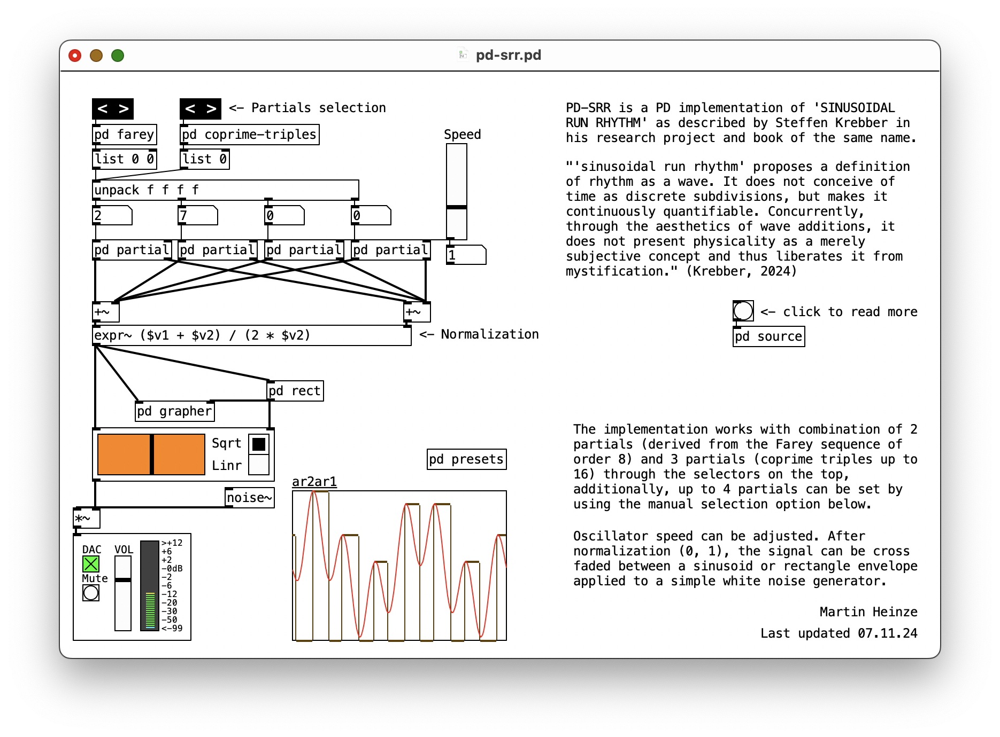

# PD-srr
 PD implementation of 'Sinusoidal Run Rhythm' by Steffen Krebber

 ## Sinusoidal Run Rhythm
 > "'sinusoidal run rhythm' proposes a definition of rhythm as a wave. It does not conceive of time as discrete subdivisions, but makes it continuously quantifiable. Concurrently, through the aesthetics of wave additions, it does not present physicality as a merely subjective concept and thus liberates it from mystification."

 Source: [Steffen Krebber, 2024](https://steffenkrebber.de/)

 ## Implementation for Pure Data
 PD-SRR is a PD implementation of Krebber's concept of 'Sinusoidal Run Rhythm' as described in his research project and book of the [same name](https://steffenkrebber.de/research/sinusoidal-run-rhythm/).

 ## Patch view

 ## Observations, open issues and questions:
 * Todo: check lists of coprime tuples and triples for validity
 * Todo: srrmod.pd component use case

 ## Other
 The repository also contains a modular component version of this implementation ("srrmod.pd") for integration into larger compositions.
